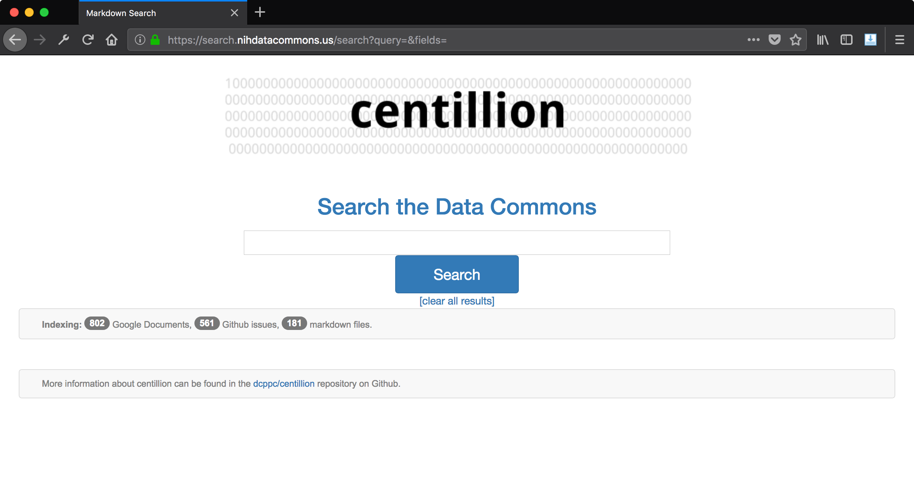

# The Centillion

**centillion**: a pan-github-markdown-issues-google-docs search engine for the Data Commons.

**a centillion**: a very large number consisting of a 1 with 303 zeros after it.

one centillion is 3.03 log-times better than a googol.




## what is it

The centillion is a search engine built using [whoosh](https://whoosh.readthedocs.io/en/latest/intro.html),
a Python library for building search engines.

We define the types of documents the centillion should index,
what info and how. The centillion then builds and
updates a search index. That's all done in `centillion_search.py`.

The centillion also provides a simple web frontend for running
queries against the search index. That's done using a Flask server
defined in `centillion.py`.

The centillion keeps it simple.


## quickstart (with Github auth)

Start by creating a Github OAuth application.
Get the public and private application key 
(client token and client secret token)
from the Github application's page.

When you create the application, set the callback
URL to `/login/github/authorized`, as in:

```
https://<url>/login/github/authorized
```

Edit the Flask configuration `config_flask.py`
and set the public and private application keys.

Now run centillion:

```
python centillion.py
```

or if you used http instead of https:

```
OAUTHLIB_INSECURE_TRANSPORT="true" python centillion.py
```

This will start a Flask server, and you can view the minimal search engine
interface in your browser at `http://<ip>:5000`.


## troubleshooting

If you are having problems with your callback URL being treated
as HTTP by Github, even though there is an HTTPS address, and
everything else seems fine, try deleting the Github OAuth app
and creating a new one.


## more info

For more info see the documentation: <https://charlesreid1.github.io/centillion>


