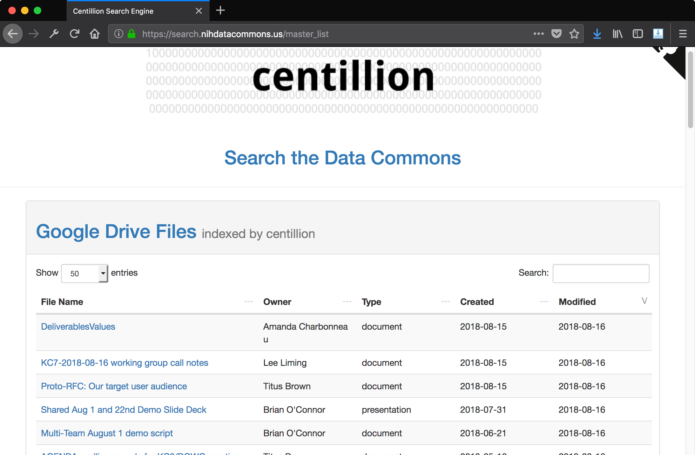

# centillion


<https://search.nihdatacommons.us/>

**centillion**: a search engine that searches across Github issues, Github pull requests, Github files, 
Google Drive documents, Groups.io email threads, and Disqus comment threads.

**a centillion**: a very large number consisting of a 1 with 303 zeros after it.

one centillion is 3.03 log-times better than a googol.


## What is centillion

centillion (<https://search.nihdatacommons.us> is a search engine that can index 
different kinds of document collections: Google Documents (.docx files), Google Drive files,
Github issues, Github files, Github Markdown files, and Groups.io email threads.


## How centillion works

We define the types of documents the centillion should index,
what info and how. centillion then builds and
updates a search index. That's all done in `centillion_search.py`.

centillion also provides a simple web frontend for running
queries against the search index. That's done using a Flask server
defined in `centillion.py`.

centillion keeps it simple.


## Quick start: using centillion

To use centillion, start with a Python script that will import
centillion, create an instance of the webapp, set any custom
configuration variables, and run the webapp. For example,
the following script is in `examples/run_centillion.py`:

```
import centillion

app = centillion.webapp.get_flask_app()

app.config['TESTING'] = True

app.run()
```

When this script is run, centillion will also look for a configuration
file containing all of the keys and settings that centillion needs to run.
This can be provided using the `CENTILLION_CONFIG` variable:

```
CENTILLION_CONFIG="conf/config_flask.py" python examples/run_centillion.py
```


## Resources for centillion

centillion repo on Github: 

centillion documentation:


## Submodules of centillion

centillion is implemented as a Python package that can be installed using
`setup.py` and imported using `import centillion`.

The package is structured as two submodules - a backend `search` submodule,
and a frontend `webapp` submodule.

### `search` submodule

The search submodule implements objects and functions to create or update
the search index on disk, load an existing search index, and performing
searches with user-provided queries.

### `webapp` submodule

The webapp submodule implements the Flask frontend, sets up the 
Flask routes, implements the Github authentication layer, and 
serves up static content and Jinja templates.


## centillion frontend: routes

### User access control for centillion 

Because centillion indexes internal and private documents for the Data Commons
project, centillion implements a Github authentication layer on top of the Flask
server. This authentication layer asks users to log in with their Github accounts,
and if the user is a member of the DCPPC organization, they are granted access to the
centillion website.

We use [flask-dance](https://github.com/singingwolfboy/flask-dance) to implement
the Github authentication layer.


### Master list

There is a master list of all content indexed by centilion at the master list page,
<https://search.nihdatacommons.us/master_list>.

A master list for each type of document indexed by the search engine is displayed
in a table:


The metadata shown in these tables can be filtered and sorted:




### Control panel

There's also a control panel at <https://search.nihdatacommons.us/control_panel> 
that allows you to rebuild the search index from scratch.  The search index
stores versions/contents of files locally, so re-indexing involves going out and
asking each API for new versions of a file/document/web page. When you re-index
the main search index, it will ask every API for new versions of every document.
You can also update only specific types of documents in the search index.


## centillion backend: searching

### Technologies

centillion is a Python program built using
[whoosh](https://bitbucket.org/mchaput/whoosh) (search
engine library).  It indexes the full text of docx files
in Google Documents, just the filenames for non-docx
files. The full text of issues and their comments are
indexed, and results are grouped by issue. centillion
requires Google Drive and Github OAuth apps. The
credentials to access these services via their respective
APIs can be accomplished by providing the API credentials
via the centillion configuration file.

### Configuration files for centillion 

To configure centillion, you should provide a single configuration file that 
specifies configuration details for both the webapp frontend and the serach 
backend. There is an example configuration file in the repo at:

```
conf/config_flask.example.py
```

The location of this configuration file should be passed in to the program
running centillion via the `CENTILLION_CONFIG` environment variable. For 
example, if the program `examples/run_centillion.py` contains a script that
imports centillion and runs the webapp, you can pass the config file using the
`CENTILLION_CONFIG` environment variable like this:

```
CENTILLION_CONFIG="conf/config_flask.py" python examples/run_centillion.py
```


### APIs used

The centillion configuration file must contain API keys for each of the following
third-party services:

* Github 
* Groups.io
* Google Drive
* Disqus

#### Github

Github API credentials (both an OAuth token for the centillion app's Github
authentication mechanism, and a personal access token for accessing repositories
during the re-indexing process) are provided in `config_flask.py`.

#### Groups.io

The Groups.io API token is used to index email threads. This token is provided in
`config_flask.py`.

#### Google Drive

The Google Drive API credentials are provided in a file, `credentials.json`. This is
the file that is generated when the OAuth process is complete.

When you enable the Google Drive API in the Google Cloud Console, you will be provided
with a file `client_secrets.json`. To authenticate centillion with Google Drive, you should
download this file, and run the Google Drive utility directly:

```
python scripts/gdrive_auth.py
```

This will initiate the authentication procedure. Sign in as a user that has access to
the documents you want to index, and _only_ the documents you want to index (it is useful
to set up a bot account for this purpose).

Once you log in as that user, it will create `credentials.json`, and the Google Drive
re-indexing procedure should not have any problems autheticating using that file.

`credentials.json` must be present in the same directory as the program being run.


## Quickstart (With Github Auth)

Start by creating a Github OAuth application.
Get the public and private application key 
(client token and client secret token)
from the Github application's page.
You will also need a Github access token
(in addition to the app tokens).

When you create the application, set the callback
URL to `/login/github/authorized`, as in:

```
https://<url>/login/github/authorized
```

Edit the Flask configuration `config_flask.py`
and set the public and private application keys.

Now run centillion:

```
python centillion.py
```

or if you used http instead of https:

```
OAUTHLIB_INSECURE_TRANSPORT="true" python centillion.py
```

This will start a Flask server, and you can view the minimal search engine
interface in your browser at `http://<ip>:5000`.


## Troubleshooting

If you are having problems with your callback URL being treated
as HTTP by Github, even though there is an HTTPS address, and
everything else seems fine, try deleting the Github OAuth app
and creating a new one.

