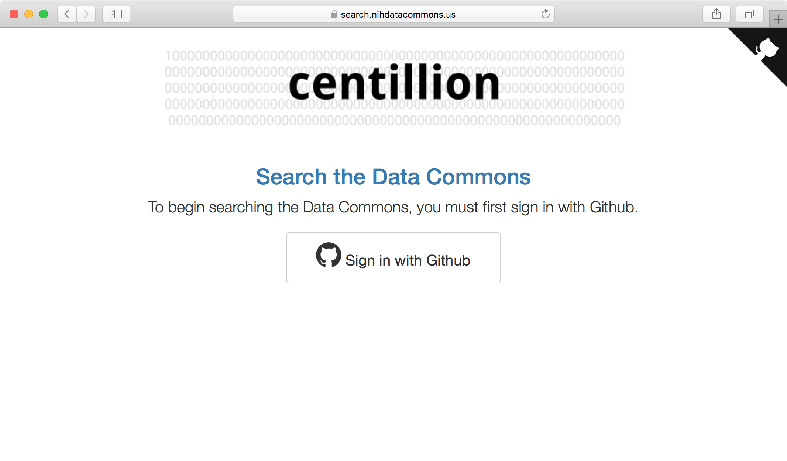

# Github Authentication Layer

## What is it?

The Github authentication layer is an access control layer
on top of the centillion web interface. It requires users
to log in to access centillion's web interface and can
request information such as login, email, or organization
membership, and use this to prevent unauthorized access
to the search engine and its contents.

This enables centillion to index private documents and 
repositories without creating Yet Another Authentication 
System.



## Quick start

To get the Github authentication layer going, start by
creating a Github OAuth application. 

Get the public and private application key 
(client token and client secret token)
from the Github application's page.

When you create the application, set the callback
URL to the base URL of your centillion server, plus
`/login/github/authorized`, as in:

```
https://<url>/login/github/authorized
```

(see "How does it work?" section below.)


## How to test locally

If you are testing centillion locally, you can use `http://localhost`
as the callback URL, but to do so you must set the following
environment variable:

```
OAUTHLIB_INSECURE_TRANSPORT="true"
```

Alternatively you can set this environment variable from the
centillion run script using the Python command:

```
import os

os.environ['OAUTHLIB_INSECURE_TRANSPORT'] = True
```


## How does it work?

The authentication layer uses [flask-dance](https://github.com/singingwolfboy/flask-dance)
(also see [flask-dance Github example](https://github.com/singingwolfboy/flask-dance)).

When users visit the centillion login page, they are automatically 
redirected to Github.com and asked to provide their Github credentials.
When the user logs in, Github passes a token to centillion that allows
the authentication layer OAuth application to request information
like which organizations the user belongs to.

The callback URL specified for the OAuth app is where users are 
redirected once they have logged in. For flask-dance this is
automatically set up to be `/login/github/authorized`.


