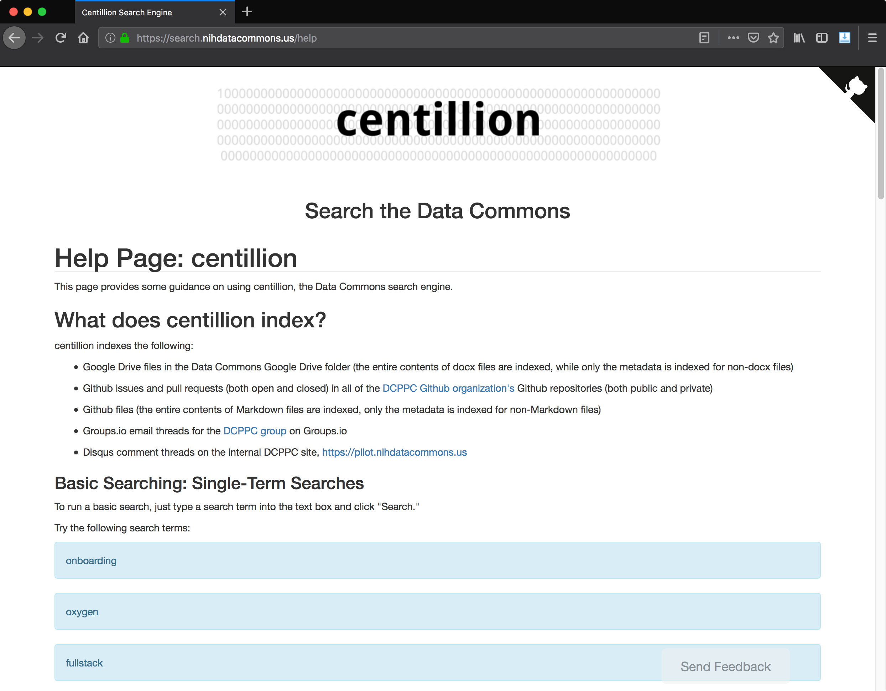
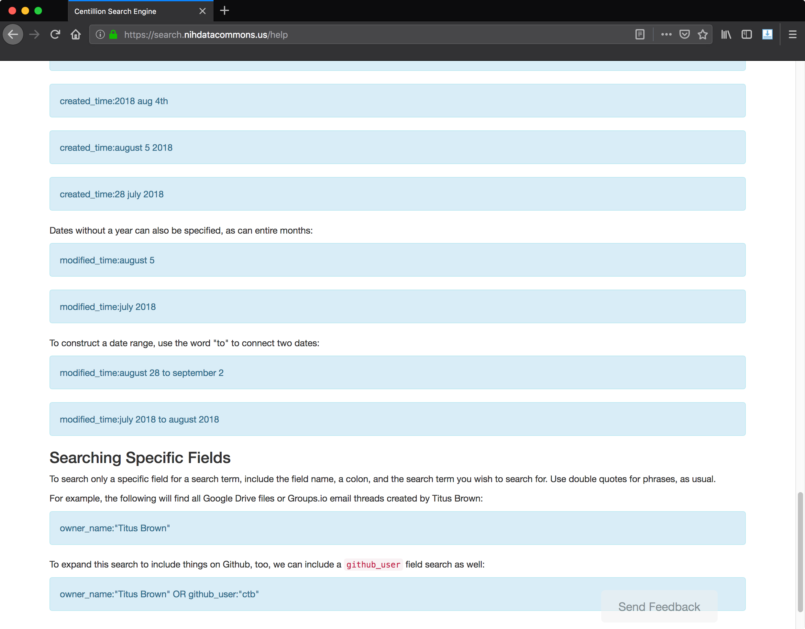
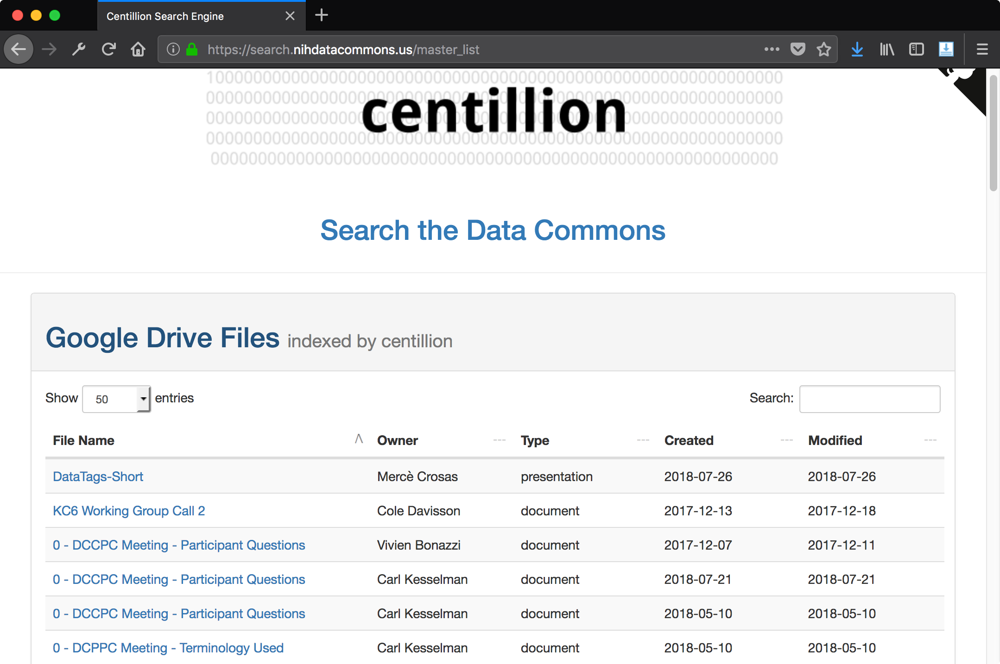
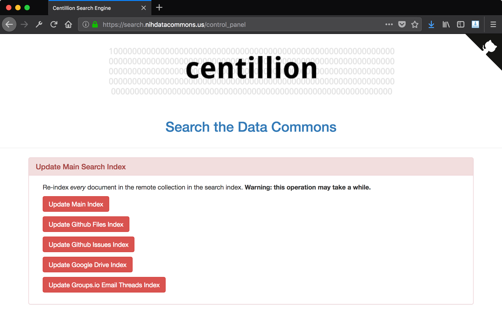

## Frontend: User access control

Because centillion indexes internal and private documents for the Data Commons
project, centillion implements a Github authentication layer on top of the Flask
server. This authentication layer asks users to log in with their Github accounts,
and if the user is a member of the DCPPC organization, they are granted access to the
centillion website.

See the [Github Authentication Layer](auth.md) page for details.

## Frontend: Flask routes

### Route: `/search`

By default, the user is redirected to the `/search` route, which provides a
text box in which the user can type their queries. Clicking on the centillion
logo at the top will always bring the user back to the search route.

### Route: `/help`

Below the centillion logo, the user is provided links to an FAQ page and a
help page. The help page provides the user with an explanation of how to search for
items, an explanation of what items are indexed, and some example queries.

Users are also provided with guidance on running advanced queries, the 
use of search operators, and a list of fields, as well as several
examples of date-based criteria:

### Route: `/faq`

Below the centillion logo, the user is provided links to an FAQ page and a
help page. The FAQ page provides the user with answers to frequently-asked
questions. Several questions were added based on user feedback.

The FAQ covers important issues like licensing of content and information about
what content is indexed and what content is not indexed. There is also 
information about how we protect the privacy of users.

### Route: `/master_list`

There is a master list of all content indexed by centillion at the master list page,
<https://search.nihdatacommons.us/master_list>.

A master list for each type of document indexed by the search engine is displayed
in a table:

The metadata shown in these tables can be filtered and sorted by clicking on the
respective columns.

### Route: `/control_panel`

The centillion control panel is located at <https://search.nihdatacommons.us/control_panel>.
The control panel allows you to rebuild the search index from scratch.  The
search index stores versions/contents of files locally, so re-indexing involves
going out and asking each API for new versions of a file/document/web page.
When you re-index the main search index, it will ask every API for new versions
of every document.  You can also update only specific types of documents in the
search index.

