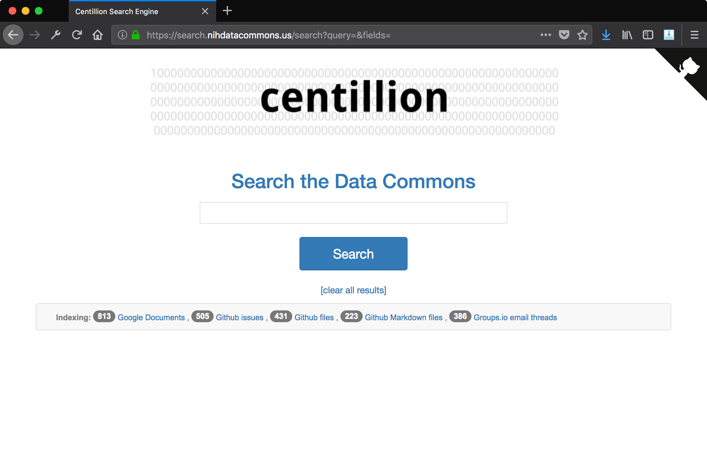

# centillion


[](https://travis-ci.org/charlesreid1/centillion)

**centillion**: a document search engine that searches
across Github issues, Github pull requests, Github files,
Google Drive documents, and Disqus comment threads.

**a centillion**: a very large number consisting of a 1 with 303 zeros after it.

One centillion is 3.03 log-times better than a googol.




## What is centillion

centillion is a search engine that can index different kinds of document
collections: Google Documents (.docx files), Google Drive files, Github issues,
Github files, Github Markdown files, and Disqus comment threads.


## How centillion works

The backend of centillion defines how documents are obtained and how
the search index is constructed. centillion builds and updates the
search index by using APIs to get the latest versions of documents,
and updates its search index accordingly. ([More information](backend.md))

The centillion frontend provides a web interface for running queries
and interfacing with the search index. ([More information](frontend.md))


## How to configure centillion

To get started with centillion, you will need to create
a centillion configuration file. Start with the example
configuration file in the `examples/` directory.

Important details to specify include:

- Access control (whether to enable it or not)
- Testing (whether we are testing or not)
- Search index location on disk
- Whether to enable Github, and what to index
- Whether to enable Google Drive, and what to index
- Whether to enable Disqus, and what to index
- API keys for all enabled services
- User interface details

See the [Configuring centillion](config.md) page
for more information.


## Quickstart

This quickstart will get you started with a centillion
instance that is populated with fake documents (avoiding
the need to make real API calls). This will allow you
to try out centillion before you enable any APIs.

**Clone:**

Start by cloning a copy of the repo:

```
cd
git clone https://github.com/dcppc/centillion
cd ~/centillion/
```

**Virtual Environment:**

(This step is optional.)

Start by setting up a virtual environment, where centillion
will be installed:

```
virtualenv vp
source vp/bin/activate
```

**Install:** 

To install centillion, first install the required packages:

```
pip install -r requirements.txt
```

Now install centillion:

```
python setup.py build install
```

Test that your centillion installation went okay:

```
python -m centillion
```

If you see no output, that means centillion has been successfully installed.
If you see an error message, check that you have activated your virtual
environment (`source vp/bin/activate`).

**Run:** 

Crete a temporary working directory:

```
mkdir -p /tmp/my-centillion-instance && cd /tmp/my-centillion-instance
```

Now create a minimal centillion instance with the following
Python program:

**`run_centillion.py`:**

```
import centillion

app = centillion.webapp.get_flask_app(config_file='config.py')
app.run()
```

The `config.py` file can be copied verbatim from the example
configuration file in the repository:

```
cp ~/centillion/config/config_centillion.example.py config.py
```

Now run the centillion instance by running the script:

```
python run_centillion.py
```

This will run the webapp on port 5000, so navigate to
<http://localhost:5000> in the browser.

**Populate the Search Index:**

To populate the search index, visit the control panel route:

<http://localhost:5000/control_panel>

From here you can re-index the search engine. The example
configuration file uses fake documents instead of real API
calls, so the reindexing will work even without a network
connection. To return to the index, click the centillion 
banner.

**Visit the Master List:**

The master list shows a list of every document indexed by
centillion. Visit the master list route:

<http://localhost:5000/master_list>

**Try Searching:**

Visit the help page for more information about running searches:

<http://localhost:5000/help>

Try searching for the following terms to see search results:

* `barley`
* `masked figure`
* `bananas`
* `bacteria`
* `microscope`


## Examples 

To see centillion in action, use the examples provided in the
`examples/` directory.

The `fakedocs` example populates a centillion instance with fake
documents, so you can try out centillion without setting up any
API keys.

There are also examples for setting up centillion instances that
index Github repositories or Google Drive folders.

The examples are:

- **Fakedocs example** - populate a centillion instance
  with some fake documents to take centillion for a test
  drive without setting up any APIs
    - Files:
    - `examples/run_centillion_fakedocs.py`
    - `config/config_centillion_fakedocs.py`

- **Google Drive example** - populate a centillion instance
  with Google Drive documents. This requires enabling the
  Google Drive API and obtaining API credentials.
  (See [APIs](apis_all.md) page.)
    - Files:
    - `examples/run_centillion_gdrive.py`
    - `config/config_centillion_gdrive.py`

- **Github example** - populate a centillion instance
  with files, issues, and pull requests from Github 
  repositories. This requires creating a Github API
  access token. (See [APIs](apis_all.md) page.)
    - Files:
    - `examples/run_centillion_github.py`
    - `config/config_centillion_github.py`


### Fakedocs example

To run the fakedocs example:

```
# make sure you have centillion installed:
python -m centillion

# run the fakedocs example
cd examples/ && python run_centillion_fakedocs.py
```

The centillion instance will be available on port 5000.
If you are running in a local machine, access centillion
by going to <http://localhost:5000> in a browser.

(This is identical to the quickstart above.)


### Github and Google Drive examples

To run the Github or Google Drive examples, 
start by setting up the respective API 
(see instructions on the [APIs](apis_all.md)
page).

Next, modify the configuration file and
paste your Github API credentials or point
to the path of your Google Drive `credentials.json`
file.

Now you can run the Github or Google Drive examples:

```
# make sure you have centillion installed:
python -m centillion

cd examples/

# run the github example
python run_centillion_gh.py

# run the Google Drive example
python run_centillion_gdocs.py
```


## Submodules 

See the [Submodules of centillion](submodules.md) page for details
about how centillion is organized into submodules.

The search functionality is implemented in centillion's 
[backend `search` submodule](backend.md). This uses the
[Whoosh library](https://bitbucket.org/mchaput/whoosh) in Python.

The web interface is implemented in centillion's
[frontend `webapp` submodule](frontend.md). This implements
a web interface for centillion using the Flask library in 
Python.

To restrict access to centillion, we implement an OAuth
application that verifies users are members of a particular 
Github organization. See [Github authentication layer](auth.md)
for details.


## APIs

See the [APIs](apis_all.md) page for an overview of the third-party
APIs that centillion interfaces with to populate the search index.

